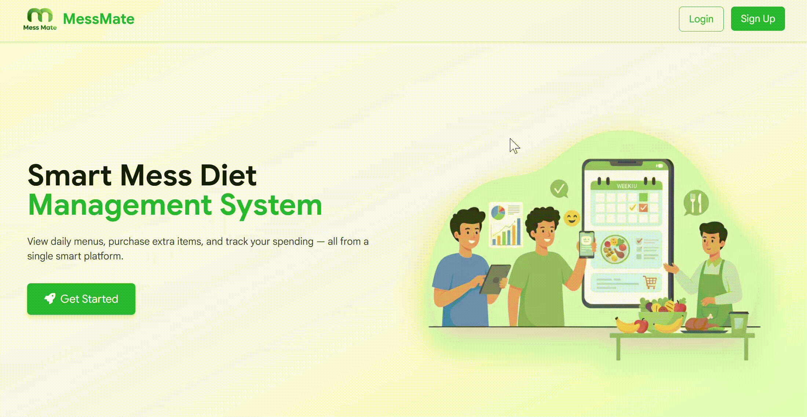

# Mess Mate - Hostel Mess Companion

Mess Mate is a comprehensive full-stack web application designed to streamline student mess diet management, track extra meal purchases, and simplify menu updates for hostel administration. 

## 🚀 Demos

Here is a quick look at the different modules of Mess Mate in action:

| Authentication |
| :---: |
|  |

| Student Portal |
| :---: |
|  |

| Accountant Dashboard |
| :---: |
|  |

| Admin Panel |
| :---: |
|  |

## ✨ Features

### 🔐 Authentication
* **Role-Based Login:** Intelligent access control that automatically routes users to their respective interfaces (Admin Panel, Accountant Dashboard, or Student Portal) based on their assigned role.
* **Versatile Login Flow:** Secure login using standard password authentication, OTP-based login, and a "forgot password" recovery option.
* **Student Sign-up:** Seamless registration asking for Name, Email, Hostel, Password, and Password Confirmation.
* **OTP Validation:** Mandatory email OTP validation directly after signup to activate the account before logging in.

### Student Portal
* **Menu Viewer:** Check today's menu instantly or browse the complete 7-day schedule by selecting specific days.
* **Purchase Tracking:** Log and update daily purchases of extra mess items by selecting the specific date and meal time.
* **Spending Analytics:** In-depth purchase analysis with customizable date ranges (last week, last month, overall, or custom month).
  * *Meal-wise Spending:* Overall expenditure broken down by specific meals.
  * *Item-wise Spending:* Breakdown of costs based on individual extra items.
  * *Trend Analysis:* Visual spending trends over the selected time frame.

### Accountant Dashboard
* **Daily Menu Management:** View and update the current day's menu, including meal timings, regular items, and extra items.
* **AI-Powered Menu Updation:** View the full weekly menu and easily update it by uploading an image of a physical menu. Powered by Generative AI, the system automatically extracts and structures the menu data from the image.

### Admin Panel
* **Hostel Management:** View complete data across all hostels.
* **Onboarding:** Add new hostels to the system and generate unique login credentials (ID & password) for their respective accountants.
* **Credential Management:** Update existing hostel data and manage accountant login credentials.
* **Student Roster Management:** Filter the student database by hostel, batch, course, or branch. Easily remove inactive or passed-out student accounts to keep the database clean.

## 🛠️ Technologies Used
* **Frontend:** React.js, Tailwind CSS
* **Backend:** Node.js, Express.js
* **Database:** MongoDB
* **AI Integration:** Gemini AI (for image-to-text menu extraction)

---
*Developed by Mukesh Kumar*