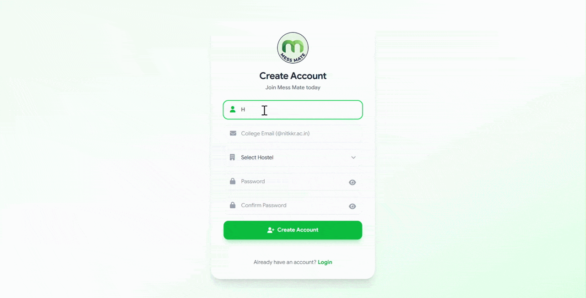
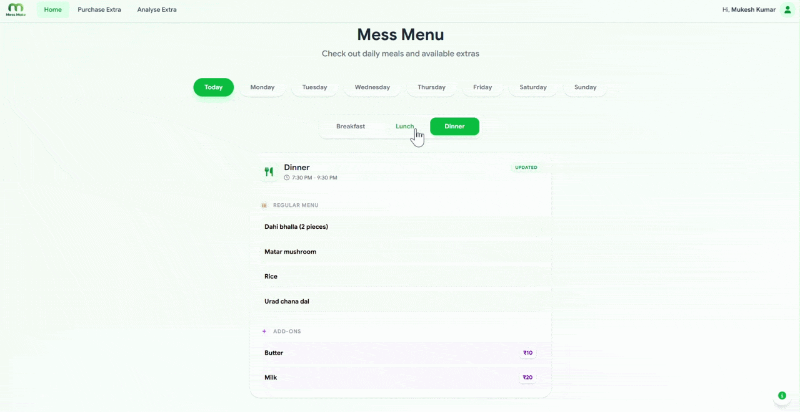
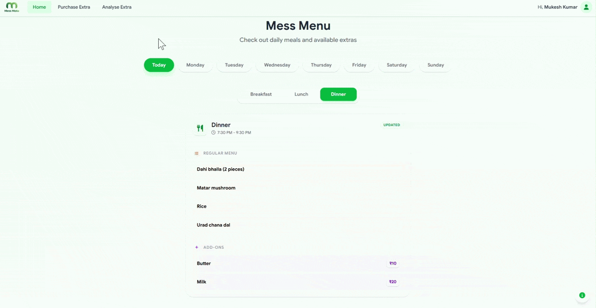
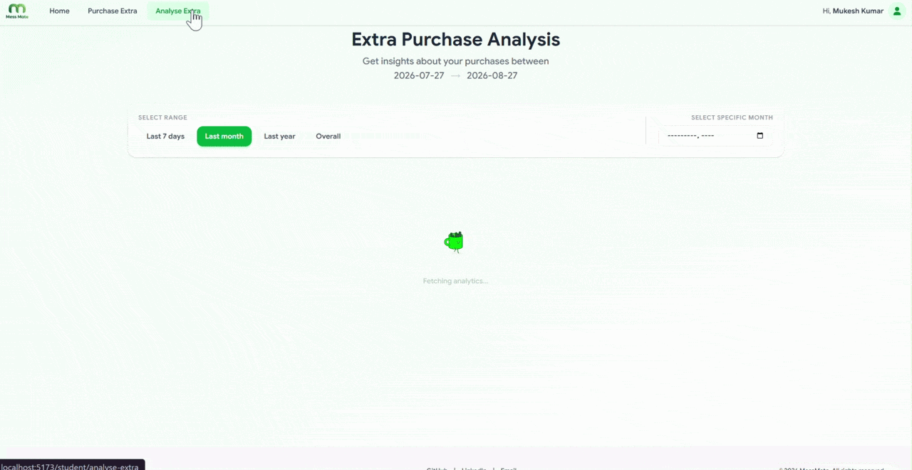
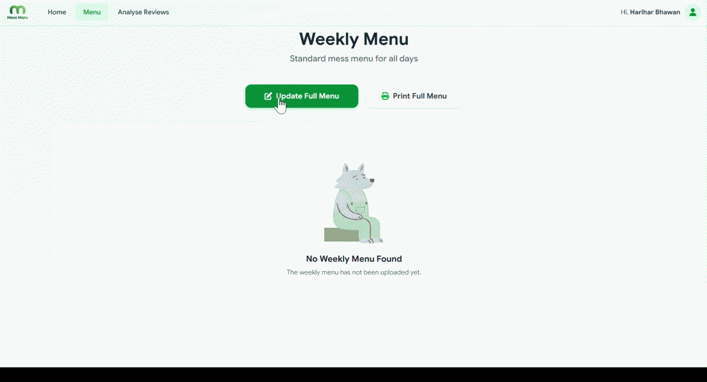
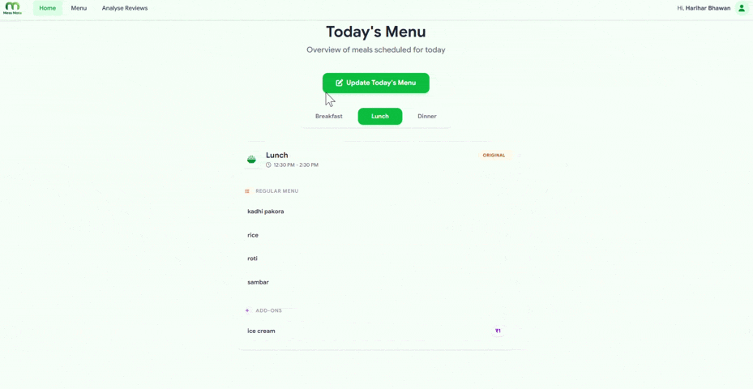
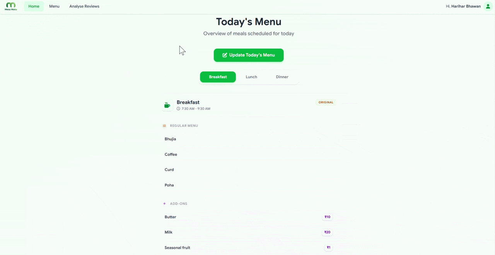
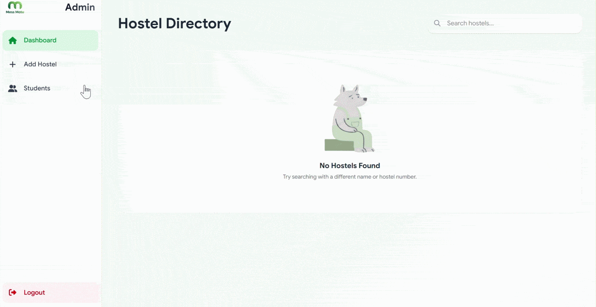
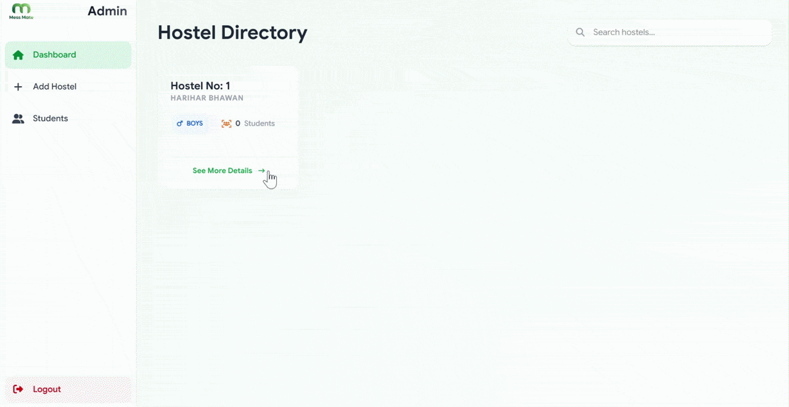
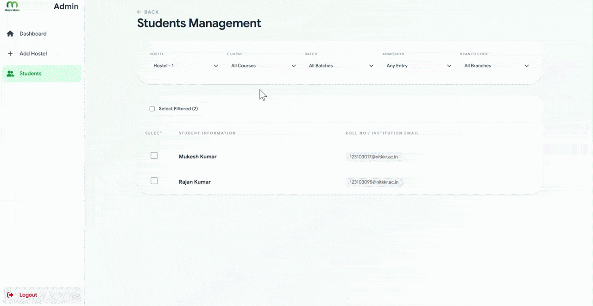

<div align="center">


# Hostel Mess Management System

**Full-stack hostel mess management platform built for NIT Kurukshetra. It gives **students** a transparent way to track menus, analyse purchases and spending, rate current menu items; gives **accountants** AI-assisted tools to manage menus and act on student feedback; and gives **admins** full control over hostel onboarding and lifecycle management — all **secured** with a hardened, defense-in-depth backend.**

[Live Demo](https://messmate-nitkkr.vercel.app)

</div>

---

## 🚀 Demos

<div align="center">

| Auth Flow |
|:---:|
|  |

| Rate Items | Purchase Extra | Analyse Purchase |
|:---:|:---:|:---:|
|  |  |  |

| Weekly Menu Upload | Today Menu Change | Reviews Analysis |
|:---:|:---:|:---:|
|  |  |  |

| Hostel Onboarding | Hostel Update | Students Management |
|:---:|:---:|:---:|
|  |  |  |


</div>

---

## ✨ Features

### 🔐 Authentication
- **Dual login flows** — traditional password login and passwordless OTP login, switchable in the UI.
- **Role-based routing** — students, accountants, and admins are automatically routed to their own protected sections (`/student`, `/accountant`, `/admin`).
- **Multi-device sessions** — users can stay logged in across multiple devices simultaneously, backed by Redis `Session tokens (refresh token)`.
- **Change password** — logged-in users can change their password; on success, all other active device sessions are revoked, backed up by `Redis SET`.
- **Log out** — revokes only the current device's session, leaving other logged-in devices unaffected.
- **Forgot-password flow** — OTP-gated identity confirmation for password reset.
- **Student's Signup**  — restricted to official `@nitkkr.ac.in` emails, followed by mandatory otp-gated email verification to activate account.


### 🎓 Student Portal
- **Menu viewer** — view today's updated menu and weekday menus.
- **Item rating system** — give stars(1-5) to items according to quality, select quick rating based contextual tags, and write a short improvement suggestion.
- **Log Extra purchases** — cart based extra purchase logging system after taking in mess with date selector (can not purchase future items).
- **Spending analytics** — server-aggregated insights using `MongoDB aggregation-pipeline ($facet)`: total spend, average/day, meal-wise pie chart, item-wise bar chart, and line graph for daily/weekly/monthly spending trend, filter date range via general tags or month selector.
- **Profile management** — switch hostel, change password, view read-only account info.

### 🧑‍💼 Accountant Dashboard
- **Today's menu override** — can edit timings, diet items, and extras, plus a standalone "quick price update" (doesn't require full menu save) per meal.
- **Weekly menu management** — full 7-day × 3-meal editor with a review before final publish.
- **AI menu extraction** — auto fill menu edit form via extrating structured menu using `Gemini AI` from menu photo.
- **AI review analysis** — Gemini aggregates the last 7 days of student feedback into: top complimented items, top complained items, items needing removal/replacement. Results are cached in MongoDB and can be force-refreshed on demand.
- **Printable weekly menu** — custom layout to print menu for physical posting using `window.print()`.

### 🛡️ Admin Panel
- **Hostel directory** — see all existing hostel with live search using name/ID/resident type.
- **Hostel onboarding** — creates the hostel and its accountant account in one step, with auto-generatable secure Login ID/password, and sends a welcome email with credentials to hostel email.
- **Hostel editing** — update hostel details and accountant credentials.
- **Cascading hostel deletion** — OTP-gated hostel delete along with all related data(accountant, students, purchases, ratings, items, menus, cache).
- **Student's account removal** — OTP-gated student's batch removal along with all related data by filtering with hostel, course, batch, admission type, and branch (parsed from roll number).

---

## 🏗️ Architecture & Engineering Highlights

### Backend design
- **Modular design** — loosely coupled, domain-oriented routes, middlewares, controllers, models, validation schemas, utilities, and configuration wrt context.
- **DTO layer** — every route has a *Zod* request schema for incoming data validation and DTO for response shaping to prevent data leaks.
- **Cache-aside Redis layer** — a generic `cacheResponse` middleware return response from redis cache on CACHE HIT and wraps `res.json` on CACHE MISS; data write/mutation call `invalidateKeys`/`invalidatePattern` to invalidate cache.
- **Daily-over-weekly menu merge** — a day's effective menu is the weekly menu, unless a `DailyMenu` *override* (by accountant) exists for that day and is explicitly marked `updated`.
- **Item catalog with soft-delete** — menu items are shared and stored in separate collection, menu only contain id referring to those items; upserted, and deactivated (`isActive = false`) rather than hard-delete; *server-side* price calculation on purchase; helps in maintaining referencial integrity and protection from tampering attack.
- **MongoDB aggregation pipelines** — `$facet` power the student analytics endpoint, in single round trip: totals, unique active days, meal-wise breakdown, top items (with an "Others" bucket), and a grouped trend series.
- **Idempotency & deduplication** — implemented idempotent apis using `Idempotency-Key` header, and idempotency in email sending using `deduplicationId`.


### Email worker microservice — delivery implementation
MessMate sends all emails asynchronously through a separate worker service, so the main API never blocks on network calls to Gmail.

1. **Enqueue** — The main backend calls `queueEmail({ email, subject, message, dedupeKey })`, which publishes the job to **QStash** (`qstashClient.publishJSON`) with a `deduplicationId` so the same email can't be enqueued twice.
2. **Deliver** — QStash calls the worker's `POST /api/jobs/send-email` endpoint, attaching an `upstash-signature` header and a unique `upstash-message-id`.
3. **Verify** — The worker verifies the signature via `@upstash/qstash`'s `Receiver`, checked against both `QSTASH_CURRENT_SIGNING_KEY` and `QSTASH_NEXT_SIGNING_KEY`.
4. **Deduplicate** — Using `upstash-message-id`, `acquireJob()` checks Redis: if this job already completed or is currently processing, the worker skips execution and returns `200` immediately to protects against QStash job retry, whose success response got lost.
5. **Get a Gmail access token** — `getAccessToken()` resolves a valid OAuth2 token with three fallback layers (ready for stateless/serverless architecture):
   - **L1**: reuse this instance's in-memory cached token if still valid.
   - **L2**: check Redis (`gmail:accessToken`) in case another instance already refreshed it.
   - **Refresh**: on a full miss, exchange the stored refresh token for a new access token via Google's OAuth2 endpoint.
6. **Build the email** — `sendEmail()` hand-builds a raw RFC 2822 MIME message (`From`, `To`, HTML content type, UTF-8-encoded `Subject`), then base64url-encodes it as Gmail's API requires.
7. **Send** — POSTs the encoded message to the Gmail REST API (`users/me/messages/send`) with the access token as a Bearer credential.
8. **Finish** —
   - On success: `completeJob()` marks the job done in Redis (24h retention) so any late retry from QStash is skipped.
   - On failure: `releaseJob()` clears the processing lock and the worker responds with `500`, letting QStash to attempt it's built-in retry.

### Security (defense in depth)
- **JWT access + refresh rotation** — short-lived (15 min) Bearer access tokens kept in memory only (never localStorage); 7-day refresh tokens in an `httpOnly`, `secure`,` cookie, with the *active* refresh token stored in Redis so on password-change/session-compromise invalidate all sessions.
- **Tiered rate limiting** — eight independently-tuned sliding-window limiters (global, credential-guessing, email sending, public reads, authenticated reads, writes, AI-heavy routes, admin writes), keyed by IP, email, or user ID.
- **NoSQL injection defense** — `@exortek/express-mongo-sanitize` on body/query plus a dedicated `paramSanitizeHandler` for route params (Express 5's read-only `req.query`/`req.params` required custom handling).
- **XSS mitigations** — a build-time script injects a strict `Content-Security-Policy` into `vercel.json` at deploy time; all interpolated email HTML and AI-generated text run through `escapeHtml`/`escapeHtmlDeep` before rendering.
- **OTP hardening** — TTL-expiring OTP documents (MongoDB TTL index), on max-attempts count forces to request a fresh OTP.
- **Destructive-action confirmation** — OTP-gated hostel deletion and batch student removal.
- **Zod validation, front and back** — a "loophole philosophy": the frontend enforces strict UX-friendly rules, while backend Zod schemas act as the permissive-but-non-negotiable data validation.
- **Standard hardening** — Helmet security headers, strict CORS allow-list, bcrypt password hashing, and centralized error handling that maps known errors to safe client-freindly messages without leaking internals.

### Frontend architecture
- **Context-per-domain state management** (`AuthContext`, `StudentContext`, `AccountantContext`, `AdminContext`) with in-memory caching to avoid redundant network calls.
- **Dual Axios clients** — a credentialed `api` instance for cookie-based auth routes and a Bearer-only `apiWithoutCred` instance for everything else.
- **Role-gated routing** with lazy-loaded route chunks (`React.lazy` + `Suspense`) and dedicated `ProtectedRoute` / `StudentRoute` / `AccountantRoute` / `AdminRoute` guards.
- **Reusable Zod-to-form-error bridge** (`validateWithZod`) used uniformly across every form in the app.
- Skeleton loaders, animated transitions, and a fully responsive, mobile-first Tailwind v4 design system throughout.

---

## 🛠️ Technology Stack
The system is composed of three independently deployed services:

| Service | Stack | Hosting |
|---|---|---|
| **Frontend** | React 18 + Vite 7 + Tailwind CSS v4 | Vercel |
| **Backend API** | Node.js + Express 5 + MongoDB | Render |
| **Email Worker** | Node.js + Express (standalone microservice) | Render |

**Frontend:** React 18, Vite 7, React Router v6, Tailwind CSS v4, Zod v4, Axios, Recharts, react-hot-toast, Lottie, browser-image-compression

**Backend:** Node.js, Express 5, MongoDB + Mongoose, JWT, bcrypt, Zod v4, Helmet, Multer, Morgan, `@exortek/express-mongo-sanitize`, `@upstash/redis`, `@upstash/qstash`,  `@upstash/ratelimit`, `@google/genai`

**Email Worker:** Node.js, Express, `@upstash/qstash` (Receiver), `@upstash/redis`, `@google/genai`

**Infrastructure / Platform:** Upstash Redis (`@upstash/redis`), Upstash Rate limiter(`@upstash/ratelimit`), Upstash QStash(`@upstash/qstash`), Google Gemini AI (`@google/genai`), Gmail API (OAuth2, REST)

---

## ⚙️ Local Setup

### Prerequisites
- [Node.js](https://nodejs.org/) v18+
- A MongoDB instance (local or Atlas)
- An [Upstash Redis](https://upstash.com/) database
- An [Upstash QStash](https://upstash.com/) account (for async email delivery)
- A [Google Gemini API key](https://aistudio.google.com/app/apikey)
- A Google Cloud OAuth2 client with Gmail API access (client ID/secret + refresh token) for the email worker

### 1. Clone the repository
```bash
git clone https://github.com/mukeshkumar99422/messmate
cd messmate
```

### 2. Backend setup
```bash
cd server
npm install
```
Create a `.env` file in `server/`:
```env
PORT=5000
NODE_ENV=development
MONGO_URI=your_mongodb_connection_string

JWT_ACCESS_SECRET=your_access_token_secret
JWT_REFRESH_SECRET=your_refresh_token_secret
CSRF_SECRET=your_csrf_secret

UPSTASH_REDIS_REST_URL=your_upstash_redis_url
UPSTASH_REDIS_REST_TOKEN=your_upstash_redis_token

QSTASH_TOKEN=your_qstash_token
EMAIL_WORKER_URL=http://localhost:5001

GEMINI_API_KEY=your_gemini_api_key
CLIENT_URL=http://localhost:5173
```

### 3. Email worker setup
```bash
cd email-worker
npm install
```
Create a `.env` file in `email-worker/`:
```env
PORT=5001
UPSTASH_REDIS_REST_URL=your_upstash_redis_url
UPSTASH_REDIS_REST_TOKEN=your_upstash_redis_token

QSTASH_CURRENT_SIGNING_KEY=your_qstash_current_signing_key
QSTASH_NEXT_SIGNING_KEY=your_qstash_next_signing_key

GMAIL_CLIENT_ID=your_gmail_oauth_client_id
GMAIL_CLIENT_SECRET=your_gmail_oauth_client_secret
GMAIL_REFRESH_TOKEN=your_gmail_oauth_refresh_token
EMAIL_USER=your_sending_email@gmail.com
```

### 4. Frontend setup
```bash
cd client
npm install
```
Create a `.env` file in `client/`:
```env
VITE_BACKEND_URL=http://localhost:5000/api
VITE_CLIENT_URL=http://localhost:5173
VITE_GITHUB_REPO_URL=https://github.com/your-username/messmate
VITE_LINKEDIN_PROFILE_URL=https://www.linkedin.com/in/your-profile
VITE_EMAIL=your-contact-email@gmail.com
```

### 5. Run all three services
```bash
# Terminal 1
cd server && npm run server

# Terminal 2
cd email-worker && npm run server

# Terminal 3
cd client && npm run dev
```

### 6. Admin initialization
The Admin role bypasses standard signup. Seed the first admin user by executing creatAdmin.js script(enter your custom id and password), then log in at `http://localhost:5173/login`.

---

*Developed by Mukesh Kumar*